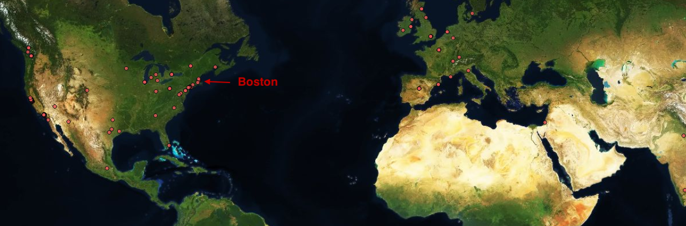

# GeoSpatial Data Project

 

## Scope:

The aim of this project is to locate the offices of a new company in the `GAMING industry`. The location should meet at least 3 of these requirements:

- There must be some nearby companies that do design ✅
- There must be a preschool nearby ✅
- There should be a starbucks not to far ✅
- It should be close to an airport ✅
- A night club should be available to throw parties ✅
- The offices should be close to tech startups that have raised at least 1 Million dollars 
- There should not be companies with more than 10 years in a radius of 2 KM 

✅: Requirements considered to do this project. 

## Source:

- Dataset: `companies.json` -> Look in the `input` folder.
- Places API: https://developers.google.com/places/web-service/intro
- Crunch API: https://data.crunchbase.com/reference#categories

## Resolution Process

1. Clean dataset: drop those columns not useful for the analysis and transform nested structures inside columns into something handy. In this case, the data selected will be `name` of the company, `category_code`(web, softare, video games, music, among others.), `office` location (this column will be expanded into 4 columns: office [[GeoJson](https://geojson.org) format], latitud, longitude and clean_state). The result will be saved in `companies_processed.json` in the `output` folder. 

2. Enrich datset: using the `latitude` and `longitude` of each office in `companies_processed.json`, through `Nearby Search requests` from `Places API` it can be obtained the latitude and longitud of Preschools, Starbucks, Airpots, and others in a predefined radio. The result will be saved in `companies_mining.json` in the `output` folder. 

3. Filter dataset: drop those offices from `companies_mining.json` that doesn't meet all the requirements (Starbucks, Preschool, Disco, Airport nearby, etc.). The result will be saved in `companies_selected.json` in the `output` folder. 

4. Represent the latitude and longitude coordinates in Tableau (or other graphic tool) for the offices, airports, starbucks, etc. These will be grouped by company name, i.e. each office should have few locations nearby of the same color.

5. Additionally, Crunch API has been used to find UX-desing companies given a specific location. Once we have the `name` and the `city` of the company, we can send a geoquery to MongoDB to check if there are companies in `companies_selected.json` close to the provided geopoint by doing a `$near` query. 

## Final location

**Latitude**: 42.3533 //
**Longitude**: -71.0627
- Name of the company: [SnapYap](https://www.crunchbase.com/organization/snapyap#section-overview)
- Preschool: Emerson colleague 200m
- Club: Sip Wine Bar <250m
- Airport: 4.8km
- Starbucks: 22m

 

